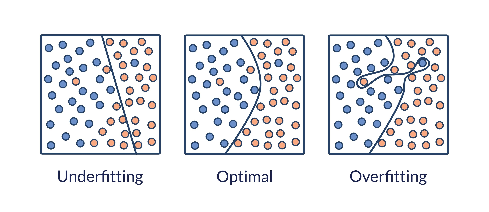

# My Diary

Today  **{{DATE_PRETTY}}**.

## General Counter
It has been    **{{DAY_SINCE_2025_08_18}}** days since I started this diary.

# Repository Counter

Day **{{DAYS_SINCE_REPO_START}}** From I started this repository

# Model Performance Diagnostics: Training vs. Validation Loss

 

| Situation | How the Curves Look | Interpretation |
| :--- | :--- | :--- |
| **Underfitting** | Both lines (Train and Val) stay **high** and do not decrease. | The model is "dumb." It fails to learn patterns from the data it sees AND the data it doesn't see. |
| **Overfitting** | Train loss keeps **decreasing** (expert), but Val loss starts to **INCREASE**. A large "gap" opens between them. | The model is **memorizing**. It becomes a "genius" at the training set but fails miserably on new data. |
| **Optimal Fit** | Both lines decrease together and **stabilize** near each other. | The model is learning real patterns that generalize well to everything. |
